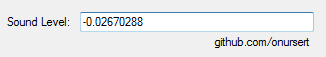

# Loud Sound Detection

Loud Sound Detection (with NAudio) - 2015 (C#)

Loud Sound Detection is a tool for Windows PCs that allow you to detect loud sound for example clap.

The interface consists of a small screen that shows the sound level on your environment. When there is a louder sound than usual, app alerts. This app uses <a href="https://github.com/naudio/NAudio">NAudio</a> for loud sound detection.

Loud Sound Detection app doesn't require installation.

<a href="https://github.com/onursert/LoudSoundDetection/raw/master/LoudSoundDetection.zip">Download Loud Sound Detection</a>
